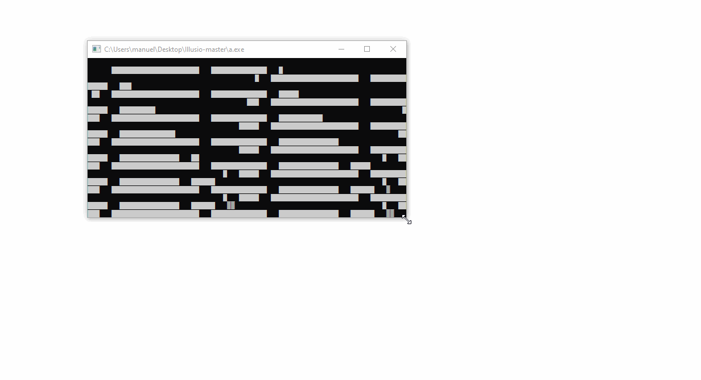

# Illusio



```Cpp
#include <math.h>
#include <iostream>
#include <vector>
#include <utility>
#include <algorithm>
#include <chrono>
#include <cstdio>
#include <stdio.h>
#include <Windows.h>
#include <string.h>

using namespace std;

int screenWidth = 120;		
int screenHeight = 40;			
int mapWidth = 16;				
int mapHeight = 16;

float xPosition = 14.7f;		
float yPosition = 5.09f;
float zPosition = 0.0f;
		
float fieldOfView = 3.14159f / 4.0f;	
float viewDepth = 16.0f;		
float speed = 5.0f;		

int main() {

	wchar_t *screen = new wchar_t[screenWidth*screenHeight];
	HANDLE console = CreateConsoleScreenBuffer(GENERIC_READ | GENERIC_WRITE, 0, NULL, CONSOLE_TEXTMODE_BUFFER, NULL);
	SetConsoleActiveScreenBuffer(console);
	DWORD screenBuffer = 0;

	wstring worldMap;
	worldMap += L"################";
	worldMap += L"#..............#";
	worldMap += L"#..............#";
	worldMap += L"#......##......#";
	worldMap += L"#......##......#";
	worldMap += L"#......##......#";
	worldMap += L"#......##......#";
	worldMap += L"#..............#";
	worldMap += L"#..............#";
	worldMap += L"#......##......#";
	worldMap += L"#......##......#";
	worldMap += L"#......##......#";
	worldMap += L"#......##......#";
	worldMap += L"#..............#";
	worldMap += L"#..............#";
	worldMap += L"################";

	auto tp1 = chrono::system_clock::now();
	auto tp2 = chrono::system_clock::now();
	
	while (1)
	{
		tp2 = chrono::system_clock::now();
		chrono::duration<float> timestamp = tp2 - tp1;
		tp1 = tp2;
		float elapsedTime = timestamp.count();

		if (GetAsyncKeyState((unsigned short)'A') & 0x8000)
			zPosition -= (speed * 0.75f) * elapsedTime;

		if (GetAsyncKeyState((unsigned short)'D') & 0x8000)
			zPosition += (speed * 0.75f) * elapsedTime;

		if (GetAsyncKeyState((unsigned short)'W') & 0x8000)
		{
			xPosition += sinf(zPosition) * speed * elapsedTime;;
			yPosition += cosf(zPosition) * speed * elapsedTime;;
			if (worldMap.c_str()[(int)xPosition * mapWidth + (int)yPosition] == '#')
			{
				xPosition -= sinf(zPosition) * speed * elapsedTime;;
				yPosition -= cosf(zPosition) * speed * elapsedTime;;
			}			
		}

		if (GetAsyncKeyState((unsigned short)'S') & 0x8000)
		{
			xPosition -= sinf(zPosition) * speed * elapsedTime;;
			yPosition -= cosf(zPosition) * speed * elapsedTime;;
			if (worldMap.c_str()[(int)xPosition * mapWidth + (int)yPosition] == '#')
			{
				xPosition += sinf(zPosition) * speed * elapsedTime;;
				yPosition += cosf(zPosition) * speed * elapsedTime;;
			}
		}

		for (int x = 0; x < screenWidth; x++)
		{

			float fRayAngle = (zPosition - fieldOfView/2.0f) + ((float)x / (float)screenWidth) * fieldOfView;

			float stepSize = 0.1f;		  									
			float distanceToObtacle = 0.0f;                            
			bool obstacleTouched = false;		
			bool obstacleVisible = false;	

			float leftEye = sinf(fRayAngle); 
			float rightEye = cosf(fRayAngle);

			while (!obstacleTouched && distanceToObtacle < viewDepth)
			{
				distanceToObtacle += stepSize;
				
                                int lookoutLeft = (int)(xPosition + leftEye * distanceToObtacle);
				int lookoutRight = (int)(yPosition + rightEye * distanceToObtacle);
				
				if (lookoutLeft < 0 || lookoutLeft >= mapWidth || lookoutRight < 0 || lookoutRight >= mapHeight)
				{
					obstacleTouched = true;		
					distanceToObtacle = viewDepth;
				}
				else
				{
					if (worldMap.c_str()[lookoutLeft * mapWidth + lookoutRight] == '#')
					{
						obstacleTouched = true;
						vector<pair<float, float>> vertices;
						for (int tx = 0; tx < 2; tx++)
							for (int ty = 0; ty < 2; ty++)
							{
								float viewPointRight = (float)lookoutRight + ty - yPosition;
								float viewPointLeft = (float)lookoutLeft + tx - xPosition;
								// Lets have a look at this plot!
                                                                // https://www.wolframalpha.com/input/?i=sqrt%28x+*+x+%2B+y+*+y%29
                                                                float look = sqrt(viewPointLeft * viewPointLeft + viewPointRight * viewPointRight); 
								float projection = (leftEye * viewPointLeft / look) + (rightEye * viewPointRight / look);
								vertices.push_back(make_pair(look, projection));
							}
						sort(vertices.begin(), vertices.end(), [](const pair<float, float> &left, const pair<float, float> &right) {return left.first < right.first; });
						float tmp = 0.01;
						if (acos(vertices.at(0).second) < tmp) obstacleVisible = true;
						if (acos(vertices.at(1).second) < tmp) obstacleVisible = true;
						if (acos(vertices.at(2).second) < tmp) obstacleVisible = true;
					}
				}
			}
		
			int roof = (float)(screenHeight/2.0) - screenHeight / ((float)distanceToObtacle);
			int ground = screenHeight - roof;
			short shaderValue = ' ';
            
			if (distanceToObtacle <= viewDepth / 4.0f) 
                            shaderValue = 0x2588;
			else if (distanceToObtacle < viewDepth / 3.0f) 
                            shaderValue = 0x2593;
			else if (distanceToObtacle < viewDepth / 2.0f) 
                            shaderValue = 0x2592;
			else if (distanceToObtacle < viewDepth) 
                            shaderValue = 0x2591;
                        else if (distanceToObtacle < viewDepth/1.5f) 
                            shaderValue = 0x2590;
			else 
                            shaderValue = ' ';	

			if (obstacleVisible) shaderValue = ' '; 
			
			for (int y = 0; y < screenHeight; y++)
			{
				if(y <= roof)
					screen[y * screenWidth + x] = ' ';
				else if(y > roof && y <= ground)
					screen[y * screenWidth + x] = shaderValue;
				else 
				{				
					float b = 1.0f - (((float)y -screenHeight/2.0f) / ((float)screenHeight / 2.0f));
					if (b < 0.25)
                        shaderValue = '#';
					else if (b < 0.5)
                        shaderValue = 'X';
					else if (b < 0.75)
                        shaderValue = 'v';
					else if (b < 0.9)
                        shaderValue = ';';
                    else if (b < 0.95)
                        shaderValue = '.';
					else
                        shaderValue = ' ';
					screen[y * screenWidth + x] = shaderValue;
				}
			}
		}
	
		screen[screenWidth * screenHeight - 1] = '\0';
		WriteConsoleOutputCharacterW(console, screen, screenWidth * screenHeight, { 0, 0 }, &screenBuffer);
	
    }
	return 0;
    
}
```
